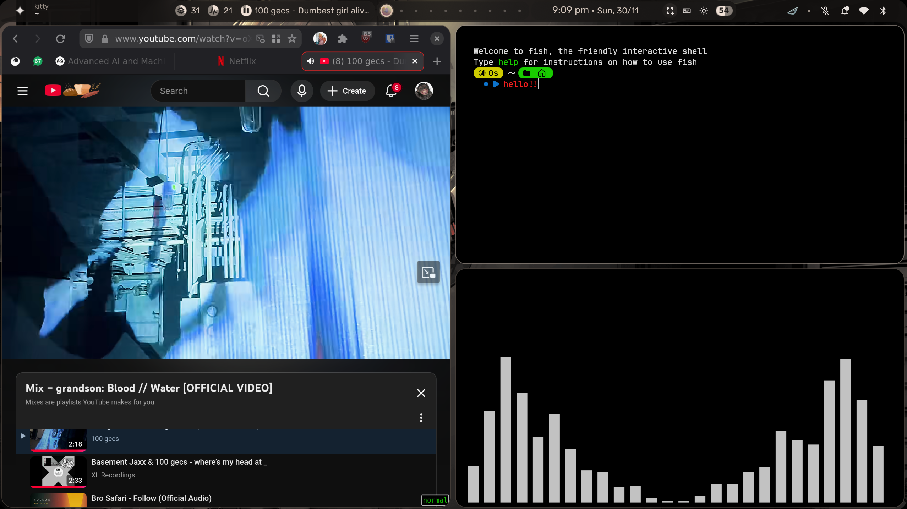

# Sanchit's NixOS Configuration

A modular NixOS configuration based on [Sly-Harvey/NixOS](https://github.com/Sly-Harvey/NixOS) structure, restructured for my own prefrences and using my old config.

#### [Deepwiki link for a better understanding of structure](https://deepwiki.com/sanchit-lamba/nixos-config)
## Screen 🧢


## Structure

```
├── flake.nix                 # Main flake configuration with inputs and settings
├── hosts/                    # Host-specific configurations
│   ├── BlitzWing/           # Current system configuration
│   │   ├── configuration.nix # Host-specific settings
│   └── common.nix           # Shared configuration across all hosts
├── modules/                 # Modular system configurations
│   ├── desktop/            # Desktop environments
│   │   ├── gnome/          # GNOME desktop configuration
│   │   ├── hyprland/       # Hyprland wayland compositor (optional)
│   │   └── wayland.nix     # Wayland application patches
│   ├── hardware/           # Hardware-specific modules
│   │   ├── drives/         # Drive and filesystem support
│   │   └── video/          # GPU driver configurations (AMD/NVIDIA/Intel)
│   ├── programs/           # Application modules
│   │   ├── browsers/       # Web browsers
│   │   ├── development/    # Development tools
│   │   ├── media/          # Media applications
│   │   ├── shell/          # Shell configurations
│   │   ├── terminal/       # Terminal applications
│   │   ├── utilities/      # System utilities
│   │   └── virtualization/ # Virtualization tools (winapps, etc.)
│   └── themes/             # Theme configurations (gruvbox)
├── home/                   # Home Manager configurations
│   └── san.nix            # User-specific configuration
├── overlays/               # Custom package overlays
└── pkgs/                   # Custom packages
```

## Key Features

- **Modular Design**: Each component is separated into its own module for easy management
- **Configurable Settings**: System settings defined in `flake.nix` for easy customization
- **Hardware Abstraction**: GPU drivers (AMD/NVIDIA/Intel) and hardware configurations are modularized
- **Desktop Environment Support**: Currently GNOME, with Hyprland ready for future use
- **Enhanced Theming**: Gruvbox dark theme with proper GTK/Qt integration
- **Modern NixOS Practices**: Uses flakes, home-manager, and latest NixOS features
- **Easy Deployment**: Automated scripts for system and home-manager deployment

## Configuration

The system is configured for:
- **User**: san
- **Hostname**: BlitzWing
- **Desktop**: GNOME with Wayland
- **GPU**: AMD (amdgpu driver)
- **Theme**: Gruvbox Dark
- **Locale**: en_IN (India)
- **Timezone**: Asia/Kolkata

## Usage

## Adding new modules

1. Create module in appropriate directory under `modules/`
2. Add import to host configuration in `hosts/BlitzWing/configuration.nix`
3. Configure module-specific settings

## Credits

- Structure inspired by [Sly-Harvey/NixOS](https://github.com/Sly-Harvey/NixOS)
- Original configuration by sanchit-lamba
- Merged and restructured for optimal modularity
